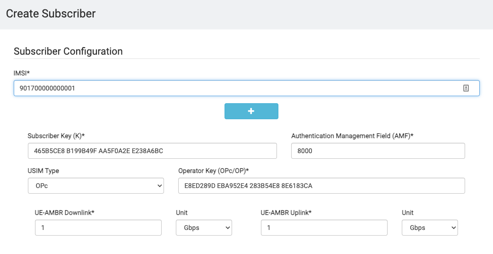
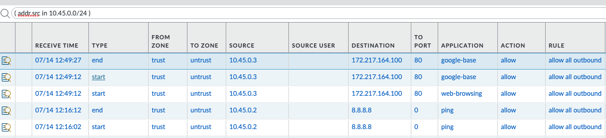

# Open5GS and UERANSIM Installation Steps

## Introduction

This lab will walk you through the steps of deploying a VPC in AWS, along with an open5Gs 5G Packet Core, and a Palo Alto Networks NGFW securing the traffic to/from the 5G core.

There will be four VMs involved in this lab:

1. The NGFW securing the N6 traffic 
2. The open5Gs packet core, excluding the UPF
3. The open5Gs UPF
4. The UE and gNodeB simulator (UERANSIM)

Most of the work to deploy the IaaS and NGFW is done by terraform templates located here.

Once terraform has run successfully, you may proceed with the steps below.


## Installing open5Gs

You can deploy the open5Gs core by building from source, or from using apt.  Since apt is much easier, that is the route this tutorial takes.

There are three hosts discussed below.  Details are captures in this table.


<table>
  <tr>
   <td>VM Nomenclature
   </td>
   <td>Description
   </td>
   <td>IP Address
   </td>
  </tr>
  <tr>
   <td>Ubuntu-EPC
   </td>
   <td>This VM is the VM running the open5Gs packet core, excluding the UPF
   </td>
   <td>10.100.2.20
   </td>
  </tr>
  <tr>
   <td>Ubuntu-UPF
   </td>
   <td>This is the VM running the open5Gs UPF
   </td>
   <td>10.100.2.21
   </td>
  </tr>
  <tr>
   <td>Ubuntu-UERANSIM
   </td>
   <td>This is the VM running the UERANSIM software
   </td>
   <td>10.100.2.22
   </td>
  </tr>
</table>


### Connecting to the Ubuntu VMs

The NGFW that was deployed using the terraform templates above boostraps with a basic configuration that has its zones, interfaces and some security and NAT policies already defined.

There is an inbound NAT policy that allows us to connect to the Ubuntu images securely over port 222, 223 and 224 from the internet.  After the terraform ran, the outputs should indicate the ssh command you can use to connect to the Ubuntu Server.  For instance, my output after just now running it was:


```
UbuntuServerSSHAccess = "ssh -i files/open5gs-testing-key ubuntu@50.18.104.90 -p 222"
FirewallManagementSSHAccess = "ssh -i files/open5gs-testing-key ubuntu@50.18.104.90 -p 222"
Ubuntu-EPC-Server-SSH-Access = "ssh -i files/open5gs-testing-key ubuntu@50.18.104.90 -p 222"
Ubuntu-UERANSIM-Server-SSH-Access = "ssh -i files/open5gs-testing-key ubuntu@50.18.104.90 -p 222"
Ubuntu-UPF-Server-SSH-Access = "ssh -i files/open5gs-testing-key ubuntu@50.18.104.90 -p 222"
WebUIAccess = "http://50.18.104.90:3000"
bucket_id = "bootstrap-<suffix>"

```


Replace the public IP address with the one from your output, and connect to the Ubuntu server.


### Install open5GS on Ubuntu-EPC

SSH to the Ubuntu-EPC server (see output from terraform for exact command), and then run the following commands:


```
sudo apt update
sudo apt install software-properties-common
sudo add-apt-repository ppa:open5gs/latest -y
sudo apt update
sudo apt install open5gs -y
```


### Install open5GS on Ubuntu-UPF

SSH to the Ubuntu-EPC server (see output from terraform for exact command), and then run the following commands:


```
sudo apt update
sudo apt install software-properties-common
sudo add-apt-repository ppa:open5gs/latest -y
sudo apt update
sudo apt install open5gs-upf -y
```


### Install NodeJS on Ubuntu-EPC


```
sudo apt update
sudo apt install curl
curl -fsSL https://deb.nodesource.com/setup_14.x | sudo -E bash -
sudo apt install nodejs -y
```


### Install MongoDB GUI Front-End on Ubuntu-EPC

There may be another way to do this, but I found downloading the open5Gs repo and then building and running the WebUI worked well.


```
git clone https://github.com/open5gs/open5gs
cd open5gs/webui
npm ci --no-optional
HOSTNAME=10.100.2.20 npm run dev > mongodb.log 2>&1 &
```


You can see the Web UI address in mongodb.log


```
Mongoose: accounts.count({}, {})
> Ready on http://10.100.2.20:3000
```


The NGFW bootstrap config should have a destination NAT and security policy to allow traffic to this internal endpoint.  To verify, try connecting to your ethernet1/1’s public IP address on port 3000 which was a terraform output labeled “`WebUIAccess`”

If successful, you should see the following screen:


Login with admin/1423

If you are able to login, move on, we will add a subscriber later.


### Install UERANSIM on Ubuntu-UERANSIM

SSH to the Ubuntu-UERANSIM VM (port 224) and follow the steps below.


```
sudo apt update
sudo apt install git make gcc g++ libsctp-dev lksctp-tools iproute2 -y
```


UERANSIM does not work with the apt version of cmake, that's why we need to install snap and the classic version of cmake:


```
sudo apt install snap
sudo snap install cmake --classic
```


Get the sources and build UERANSIM:


```
cd ~
git clone https://github.com/aligungr/UERANSIM
cd UERANSIM
make
(go get a coffee)
```


### Stop all open5Gs elements on Ubuntu-EPC

We have more NFs running than we want so lets stop them all and then bring up the ones we care about.


```
sudo systemctl stop open5gs-mmed
sudo systemctl stop open5gs-sgwcd
sudo systemctl stop open5gs-smfd
sudo systemctl stop open5gs-amfd
sudo systemctl stop open5gs-sgwud
sudo systemctl stop open5gs-upfd
sudo systemctl stop open5gs-hssd
sudo systemctl stop open5gs-pcrfd
sudo systemctl stop open5gs-nrfd
sudo systemctl stop open5gs-ausfd
sudo systemctl stop open5gs-udmd
sudo systemctl stop open5gs-pcfd
sudo systemctl stop open5gs-nssfd
sudo systemctl stop open5gs-bsfd
sudo systemctl stop open5gs-udrd
```


### Update open5gs IP addressing

We have our 5G core spread across two servers, so we’ll need to insert their IP addresses in the appropriate spots.  Most of the SBA interfaces will be on the Ubuntu-EPC host, and communicate with one another internally all that host via private IP addresses (e.g. 127.0.0.7).  


#### Edit the UPF Addresses

If you aren’t already on the Ubuntu-UPF CLI, connect to it now.  Traffic to the internet will need to egress 10.100.2.21, so lets put the UPF on this IP.


```
sudo vi /etc/open5gs/upf.yaml 
```


Change the upf config section to reflect the following:


```
upf:
    pfcp:
      - addr: 10.100.2.21
    gtpu:
      - addr: 10.100.2.21
    subnet:
      - addr: 10.45.0.1/16
      - addr: 2001:db8:cafe::1/48
```


#### Edit the SMF Address

On the Ubuntu-EPC host, edit the SMF config:


```
sudo vi /etc/open5gs/smf.yaml
```


Change the SMF config section to reflect the following:


```
smf:
    sbi:
      - addr: 127.0.0.4
        port: 7777
    pfcp:
      - addr: 10.100.2.20
      - addr: ::1
    gtpc:
      - addr: 127.0.0.4
      - addr: ::1
    gtpu:
      - addr: 10.100.2.20
      - addr: ::1
    subnet:
      - addr: 10.45.0.1/16
      - addr: 2001:db8:cafe::1/48
    dns:
      - 8.8.8.8
      - 8.8.4.4
      - 2001:4860:4860::8888
      - 2001:4860:4860::8844
    mtu: 1400
    ctf:
      enabled: auto
    freeDiameter: /etc/freeDiameter/smf.conf
```


Scroll down further to change the UPF address:


```
upf:
    pfcp:
      - addr: 10.100.2.21
```


## Update UERANSIM Config

UERANSIM has two components, the UE and the gNodeB (radio simulator).  Below are the steps to change the configs for each of these.


### Change UERANSIM PLMN and IPs

There are two config files we will update on the Ubuntu-UERANSIM VM, the gNodeB config file and the UE config file.


#### Update the gNodeB Config

From UERANSIM directory:


```
vi config/open5gs-gnb.yaml
```


Set MCC to 901


```
mcc: '901'          # Mobile Country Code value
mnc: '70'           # Mobile Network Code value (2 or 3 digits)
```


Also change the `gtpIp` and `ngapIp`.


```
ngapIp: 10.100.2.22
gtpIp: 10.100.2.22    
```


#### Update the UE Config

From UERANSIM Directory:


```
vi config/open5gs-ue.yaml
```


Change the PLMN (MNC) from 999 to 901 in the supi value, and also for the “mcc” variable.


```
# IMSI number of the UE. IMSI = [MCC|MNC|MSISDN] (In total 15 digits)
supi: 'imsi-901700000000001'
# Mobile Country Code value of HPLMN
mcc: '901'
# Mobile Network Code value of HPLMN (2 or 3 digits)
mnc: '70'
```


### Start the UPF on Ubuntu-UPF


```
sudo systemctl start open5gs-upfd
```


You can verify it started by looking at `/var/log/open5gs/upf.log`


### Start select NFs on Ubuntu-EPC


```
sudo systemctl start open5gs-nrfd
sudo systemctl start open5gs-smfd
sudo systemctl start open5gs-amfd
sudo systemctl start open5gs-ausfd
sudo systemctl start open5gs-udmd
sudo systemctl start open5gs-udrd
sudo systemctl start open5gs-pcfd
sudo systemctl start open5gs-bsfd
sudo systemctl start open5gs-nssfd
```


It is recommended to take these commands and put them in a script to make your life easier.


### Stop Uncomplicated FW on Ubuntu-UPF

Check and see if the “ufw” is running.  If it is then disable it.


```
​​~$ systemctl status ufw
● ufw.service - Uncomplicated firewall
   Loaded: loaded (/lib/systemd/system/ufw.service; enabled; vendor preset: enabled)
   Active: active (exited) since Wed 2022-06-29 18:26:31 UTC; 5h 38min ago
     Docs: man:ufw(8)
 Main PID: 506 (code=exited, status=0/SUCCESS)
    Tasks: 0 (limit: 1105)
   CGroup: /system.slice/ufw.service
```


Let’s stop and disable it:


```
$ sudo systemctl stop ufw
$ sudo systemctl disable ufw
```


### Edit packet forwarding on Ubuntu-UPF and Ubuntu-EPC

We will need to make two changes to the Ubuntu VM to allow it to forward the packets through the UPF to the NGFW.  I’m not 100% sure if its needed on the Ubuntu-EPC as well, but since its forwarding packets over GTP to the UPF, I’m guessing we need it there too.

On both hosts run:


```
sudo sysctl -w net.ipv4.ip_forward=1
sudo iptables -I FORWARD 1 -j ACCEPT
```


### Add Subscriber(s) to database

Note the IMSI in the `open5gs-ue.yaml` file.  We will need to add that to the subscriber database.  Most of the settings in the file can remain unchanged.

The first line of the file `open5gs-ue.yaml `contains the IMSI.  Make sure the first 3 digits are your MNC, e.g. 901, not the default value of 999


```
# IMSI number of the UE. IMSI = [MCC|MNC|MSISDN] (In total 15 digits)
supi: 'imsi-901700000000001'.
```


Log back into the database front end.  The URL to use should be included in the terraform output (`WebUIAccess`).  Paste
in the value of the IMSI (excluding the "imsi-" prefix) to the IMSI field.





Note: You can repeat this procedure for additional subscribers.  Just create additional open-5gs-ue files (e.g. open5gs-ue-2.yaml) with updated IMSI values (e.g. `imsi-901700000000002).`


## Place 5G Calls

Now that the 5G core is up and running, subscribers have been configured and the software radio and UE have been configured, we should be able to create a 5G session.


### Launch gNodeB on Ubuntu-UERANSIM

The gNodeB is the cell site for 5G networks.  UERANSIM allows us to launch a simulated version of this using the appropriate config file.

To do so, from our home directory we run: 


```
./UERANSIM/build/nr-gnb -c UERANSIM/config/open5gs-gnb.yaml 
```


If all goes well you should see something like:

```
UERANSIM v3.2.6
[2022-07-14 19:00:17.085] [sctp] [info] Trying to establish SCTP connection... (10.100.2.20:38412)
[2022-07-14 19:00:17.095] [sctp] [info] SCTP connection established (10.100.2.20:38412)
[2022-07-14 19:00:17.095] [sctp] [debug] SCTP association setup ascId[4]
[2022-07-14 19:00:17.095] [ngap] [debug] Sending NG Setup Request
[2022-07-14 19:00:17.095] [ngap] [debug] NG Setup Response received
[2022-07-14 19:00:17.096] [ngap] [info] NG Setup procedure is successful
```


### Launch UE on Ubuntu-UERANSIM

Now that the gNodeB simulator is running, we can run our UE simulator and have it attach to the gNodeB.  We will once again use the UERANSIM tool to do this.


```
sudo ./UERANSIM/build/nr-ue -c UERANSIM/config/open5gs-ue.yaml
```


If this goes well, you should see something like:

```
$ sudo ./UERANSIM/build/nr-ue -c UERANSIM/config/open5gs-ue.yaml 

UERANSIM v3.2.6
[2022-06-29 21:48:33.605] [rrc] [debug] New signal detected for cell[1], total [1] cells in coverage
[2022-06-29 21:48:33.605] [nas] [info] UE switches to state [MM-DEREGISTERED/PLMN-SEARCH]
[2022-06-29 21:48:33.605] [nas] [info] Selected plmn[901/70]
[2022-06-29 21:48:33.605] [rrc] [info] Selected cell plmn[901/70] tac[1] category[SUITABLE]
[2022-06-29 21:48:33.606] [nas] [info] UE switches to state [MM-DEREGISTERED/PS]
[2022-06-29 21:48:33.606] [nas] [info] UE switches to state [MM-DEREGISTERED/NORMAL-SERVICE]
[2022-06-29 21:48:33.606] [nas] [debug] Initial registration required due to [MM-DEREG-NORMAL-SERVICE]
[2022-06-29 21:48:33.609] [nas] [debug] UAC access attempt is allowed for identity[0], category[MO_sig]
[2022-06-29 21:48:33.609] [nas] [debug] Sending Initial Registration
[2022-06-29 21:48:33.609] [rrc] [debug] Sending RRC Setup Request
[2022-06-29 21:48:33.610] [rrc] [info] RRC connection established
[2022-06-29 21:48:33.614] [rrc] [info] UE switches to state [RRC-CONNECTED]
[2022-06-29 21:48:33.614] [nas] [info] UE switches to state [MM-REGISTER-INITIATED]
[2022-06-29 21:48:33.615] [nas] [info] UE switches to state [CM-CONNECTED]
[2022-06-29 21:48:33.620] [nas] [debug] Authentication Request received
[2022-06-29 21:48:33.622] [nas] [debug] Security Mode Command received
[2022-06-29 21:48:33.623] [nas] [debug] Selected integrity[2] ciphering[0]
[2022-06-29 21:48:33.630] [nas] [debug] Registration accept received
[2022-06-29 21:48:33.630] [nas] [info] UE switches to state [MM-REGISTERED/NORMAL-SERVICE]
[2022-06-29 21:48:33.630] [nas] [debug] Sending Registration Complete
[2022-06-29 21:48:33.630] [nas] [info] Initial Registration is successful
[2022-06-29 21:48:33.630] [nas] [debug] Sending PDU Session Establishment Request
[2022-06-29 21:48:33.630] [nas] [debug] UAC access attempt is allowed for identity[0], category[MO_sig]
[2022-06-29 21:48:33.833] [nas] [debug] Configuration Update Command received
[2022-06-29 21:48:33.846] [nas] [debug] PDU Session Establishment Accept received
[2022-06-29 21:48:33.848] [nas] [info] PDU Session establishment is successful PSI[1]
[2022-06-29 21:48:34.152] [app] [info] Connection setup for PDU session[1] is successful, TUN interface[uesimtun0, 10.45.0.6] is up.
At this point the UE is registered with the 5G core.  A tunnel interface has been created on the Ubuntu-UERANSIM host that you can send traffic through to have it emulate sending traffic from the UE.  When you send traffic through this interface, it will get tunneled via GTP to the UPF NF, and then sent out its interface with the IP address (10.45.0.x) that the UPF gave it.  The NGFW will see this packet and NAT it to the untrust interface on the NGFW.
The tunnel interface is called “uesimtun0”.  To send traffic through it, use the appropriate parameter for the tool of your choice.  Examples for `ping` and `curl` are shown below.
```

```
$ ping -I uesimtun0 8.8.8.8

$ curl --interface uesimtun0 http://www.google.com
```


## Verify Traffic on NGFW

On the NGFW, you should see the traffic egressing from the UPF towards the internet.  
Below are some examples from two sessions I had, with ping and curl traffic.





## Conclusion

Congratulations!  You have successfully deployed a 5G core and a Next Generation Firewall from Palo Alto Networks to secure the traffic from that core to the internet.
